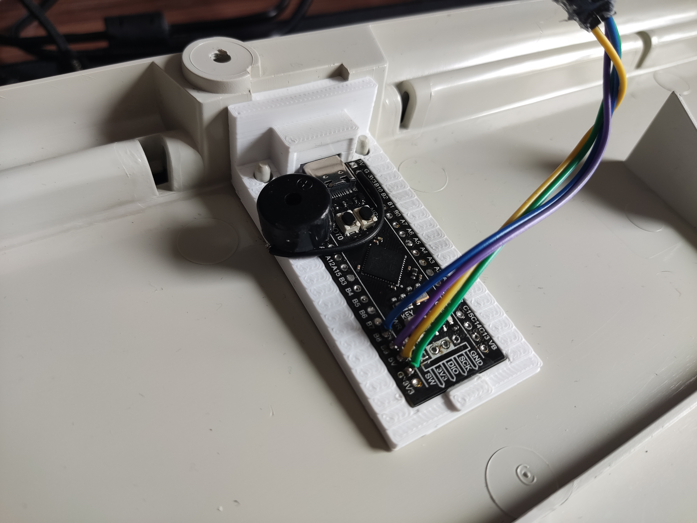
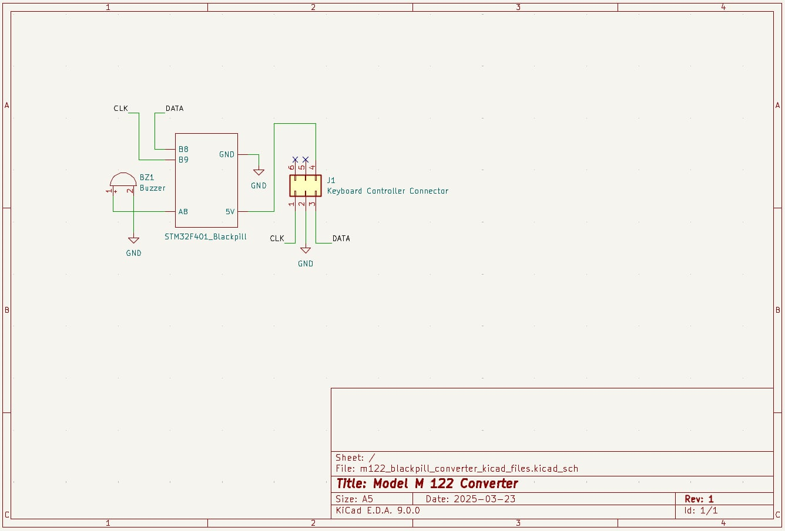
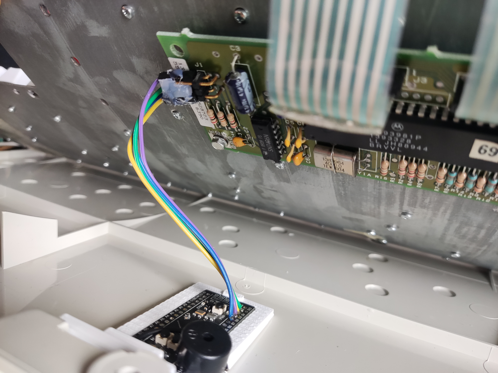
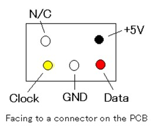
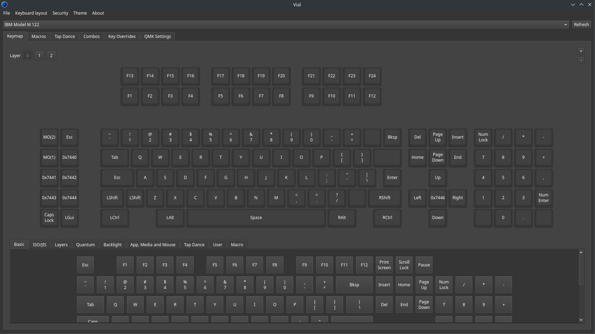

# IBM Model M 122 terminal keyboard converter

This converter uses an STM32F401 Blackpill board like [this one](https://stm32-base.org/boards/STM32F401CEU6-WeAct-Black-Pill-V3.0) to convert an IBM Model M 122 terminal keyboard from RJ45/Scancode Set 3 to modern USB-C keyboard with `qmk` firmware and proper `vial` support.

This repository houses the files for the 3D printed mount for the Blackpill as well as a schematic and some photos of the conversion.

The `qmk-vial` fork for this converter can be found [here](https://github.com/lokuciejewski/vial-qmk). Follow the instructions in the [readme](https://github.com/lokuciejewski/vial-qmk/blob/vial/keyboards/converter/ibm_m122/readme.md) to build and flash the firmware.

This conversion was tested on my 1394104 model M which was bundled with an IBM InfoWindow II terminal model 3482.

For more photos, see the [here](./media/converter/)

## Assembly tips

When soldering the wires to the Blackpill, try to make them as flat as possible on the underside as the mount does not accomodate for too much solder under the Blackpill. When mounting the piezo buzzer, make sure it does not dangle on the wires to avoid it touching the controller board and shorting something. I just soldered one of the piezo directly to the Blackpill to make it secure in place.

## Schematics

See [kicad files](./m122_blackpill_converter_kicad_files/) for an editable version of the schematics.

## 3D Printed mount

The 3D printed mount can be found [here](./3d_printed_mount/Model%20M%20Blackpill%20Mount.stl). I recommend printing with PLA+/ABS but any type of plastic should do just fine :)

I recommend adding some tree supports for the overhangs but I also managed to print it just fine without them.
Depending on your printer tolerances, the mount may be a tight fit. After pressing it down, it should lay mostly flat on the surface of the keyboard case.
Since the Blackpill is rather long, it needed to be tilted a bit to avoid touching the original controller board.

## Connection to the keyboard

I used some hot glue to keep the wires together as I plugged and unplugged it quite often during the initial development phase.

The pinout on the original controller:

## Vial support

This converter adds 3 programmable layers for the `vial` software as well as a custom keymap to make rebinding keys easier. Empty keys are not populated on my keyboard. Keys with hex values (such as `0x7440`) are just programmable keys.

